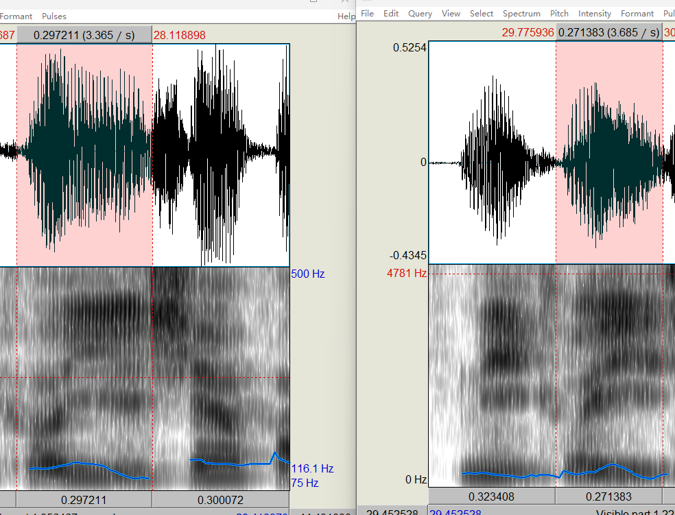

# 鉴定意见书

## 一、绪论

**1、委托单位：**××××××××××××

**2、送检人：**××× ×××

**3、受理日期：**2022年11月29日 

**4、检材：**存储在××××中的语音文件，文件名：检材.wav，文件大小：2.22MB，文件格式：wav 哈希值：1D901BCF24CD64454B5BFF35E2F50497（以下简称检材）。

**5、样本：**存储在××××中的语音文件，文件名：样本.wav，文件大小：2.39MB，文件格式：wav 哈希值： 612B8AD7182CB1A1DFC233A4A792100F（以下简称样本）。

**6、鉴定要求：**鉴定检材样本是否为同一人。

**7、检验时间：**2022年11月29日至2022年2月5日

**8、检验地点：**南方科技大学

## 二、检验过程

**标准：**×××× 《××××技术规范》。

**设备：**Praat语音分析软件系统。

**（一）初步检验**

​    **1、对检材的检验**

​    将检材在上述语音分析软件系统打开（采样率16KHz，单声道“wav”格式， 位深16）。

​    经审听，检材语音自然、流畅，音量、语速适中，听觉特征反映充分;经图谱观察，频谱特征反映充分，未发现伪装变化迹象，具备检验条件。

​    **2、对样本的检验**

​     将样本上述语音分析软件系统中打开（采样率16KHz，单声道“wav”格式， 位深16）**。** 

​     经审听，样本语音自然、流畅，音量、语速适中，听觉特征反映充分，未发现伪装变化迹象;经图谱观察，频谱特征反映充分，具备检验条件

**（二）比对检验**

​     **1、听觉比对检验**

​     经对检材语音与样本语音进行比对审听，发现以下主要差异点：

 	1. 样本嗓音明亮，高纯度，标准北方口音。检材嗓音中等纯度，混杂南方口音。
 	2. 在对汉字`收`的发音中，样本3.55s-3.89s发音为`zhou`，而检材2.72s-2.96s中发音为`shou`。
 	3. 在对汉字`刘`的发音中，样本2.75s-3.10s 发音为`liu`，而检材2.06s-2.38s中发音为`niu`。

​     **2、声谱比对检验** 

​    使用上述语音分析软件系统对检材语音和样本语音的宽带声谱的形态特征进行比对分析；发现以下差异点：

  1. 汉字`姐`  （图谱见附录一）

     |            | 检材     | 样本               |
     | ---------- | -------- | ------------------ |
     | 第一共振峰 | 由低到高 | 由低到高           |
     | 第二共振峰 | 先平后低 | 由高到低  较直下降 |
     | 第三共振峰 | 平       | 由高到低           |
     | 第四共振峰 | 平       | 平                 |
     | 第五共振峰 | 平       | 平                 |

  2.  英文字母`Q` （图谱见附录二）

     |            | 检材           | 样本     |
     | ---------- | -------------- | -------- |
     | 第一共振峰 | 平             | 平       |
     | 第二共振峰 | 由高到低再到高 | 平       |
     | 第三共振峰 | 先平后高       | 由高到低 |
     | 第四共振峰 | 平             | 平       |
     | 第五共振峰 | 平             | 平       |

  3.  汉字`刚`  （图谱见附录三）

     |            | 检材     | 样本     |
     | ---------- | -------- | -------- |
     | 第一共振峰 | 平       | 平       |
     | 第二共振峰 | 平       | 平       |
     | 第三共振峰 | 先平后高 | 由低到高 |
     | 第四共振峰 | 平       | 先平后高 |
     | 第五共振峰 | 平       | 平       |

  4.  汉字`报`  （图谱见附录四）

     |            | 检材         | 样本     |
     | ---------- | ------------ | -------- |
     | 第一共振峰 | 平           | 平       |
     | 第二共振峰 | 微微由高到低 | 平       |
     | 第三共振峰 | 平           | 由低到高 |
     | 第四共振峰 | 平           | 平       |
     | 第五共振峰 | 平           | 平       |

  5.  汉字`好`  （图谱见附录五）

     |            | 检材 | 样本 |
     | ---------- | ---- | ---- |
     | 第一共振峰 | 平   | 平   |
     | 第二共振峰 | 平   | 平   |
     | 第三共振峰 | 平   | 平   |
     | 第四共振峰 | 平   | 平   |
     | 第五共振峰 | 平   | 平   |

  6.  汉字`姐`  （图谱见附录六）

     |            | 检材         | 样本 |
     | ---------- | ------------ | ---- |
     | 第一共振峰 | 平           | 平   |
     | 第二共振峰 | 平           | 平   |
     | 第三共振峰 | 微微由低到高 | 平   |
     | 第四共振峰 | 紊乱         | 平   |
     | 第五共振峰 | 紊乱         | 平   |

  7.  汉字`可以`  （图谱见附录七）

     |            | 检材         | 样本         |
     | ---------- | ------------ | ------------ |
     | 第一共振峰 | 平           | 平           |
     | 第二共振峰 | 由低到高后平 | 由低到高     |
     | 第三共振峰 | 由低到高后平 | 由低到高后平 |
     | 第四共振峰 | 平           | 由低到高后平 |
     | 第五共振峰 | 平           | 平           |

  8.  汉字`话`  （图谱见附录八）

     |            | 检材 | 样本     |
     | ---------- | ---- | -------- |
     | 第一共振峰 | 平   | 平       |
     | 第二共振峰 | 平   | 由高到低 |
     | 第三共振峰 | 平   | 平       |
     | 第四共振峰 | 平   | 平       |

​    **3、测量比对检验**

​     使用上述语音分析软件系统对检材语音和样本语音的宽带声谱的数值特征进行比对分析；发现以下差异点：

1.  汉字`姐`  （图谱见附录一）

   |            | 检材    | 样本    |
   | ---------- | ------- | ------- |
   | 第一共振峰 | 418.2Hz | 433.6Hz |
   | 第二共振峰 | 1862Hz  | 1786Hz  |
   | 第三共振峰 | 2661Hz  | 2630Hz  |
   | 第四共振峰 | 3721Hz  | 3844Hz  |
   | 第五共振峰 | 4213Hz  | 4904Hz  |

   其在前四个共振峰的频率差距较大。

2.  英文字母`Q`（图谱见附录二）

   |            | 检材    | 样本    |
   | ---------- | ------- | ------- |
   | 第一共振峰 | 432.7Hz | 372.2Hz |
   | 第二共振峰 | 1507Hz  | 1079Hz  |
   | 第三共振峰 | 2054Hz  | 2016Hz  |
   | 第四共振峰 | 3501Hz  | 3214Hz  |
   | 第五共振峰 | 4222Hz  | 3859Hz  |

3.  汉字`刚`  （图谱见附录三）

   |            | 检材    | 样本    |
   | ---------- | ------- | ------- |
   | 第一共振峰 | 816.2Hz | 756.2Hz |
   | 第二共振峰 | 1476Hz  | 1263Hz  |
   | 第三共振峰 | 2580Hz  | 2615Hz  |
   | 第四共振峰 | 3792Hz  | 4075Hz  |
   | 第五共振峰 | 4728Hz  | 4935Hz  |

4.   汉字`报`  （图谱见附录四）

   |            | 检材    | 样本    |
   | ---------- | ------- | ------- |
   | 第一共振峰 | 540.1Hz | 510.4Hz |
   | 第二共振峰 | 1062Hz  | 1202Hz  |
   | 第三共振峰 | 2412Hz  | 2385Hz  |
   | 第四共振峰 | 3608Hz  | 3737Hz  |
   | 第五共振峰 | 4805Hz  | 4966Hz  |

5.  汉字`好`  （图谱见附录五）

   |            | 检材    | 样本    |
   | ---------- | ------- | ------- |
   | 第一共振峰 | 432.7Hz | 495.5Hz |
   | 第二共振峰 | 1046Hz  | 1217Hz  |
   | 第三共振峰 | 2534Hz  | 2659Hz  |
   | 第四共振峰 | 3669Hz  | 3414Hz  |
   | 第五共振峰 | 4329Hz  | 4274Hz  |

6.  汉字`时`  （图谱见附录六）

   |            | 检材    | 样本    |
   | ---------- | ------- | ------- |
   | 第一共振峰 | 509.4Hz | 387.5Hz |
   | 第二共振峰 | 1399Hz  | 1248Hz  |
   | 第三共振峰 | 2534Hz  | 2861Hz  |
   | 第四共振峰 | 紊乱    | 3859Hz  |
   | 第五共振峰 | 紊乱    | 4781Hz  |

7.  汉字`可以`  （图谱见附录七）

   |            | 检材    | 样本    |
   | ---------- | ------- | ------- |
   | 第一共振峰 | 463.4Hz | 387.5Hz |
   | 第二共振峰 | 1905Hz  | 1955Hz  |
   | 第三共振峰 | 2948Hz  | 2769Hz  |
   | 第四共振峰 | 4053Hz  | 3952Hz  |
   | 第五共振峰 | 4953Hz  | 4900Hz  |

8.  汉字`话`  （图谱见附录八）

   |            | 检材    | 样本    |
   | ---------- | ------- | ------- |
   | 第一共振峰 | 678.2Hz | 456.2Hz |
   | 第二共振峰 | 2427Hz  | 2216Hz  |
   | 第三共振峰 | 3623Hz  | 3506Hz  |
   | 第四共振峰 | 4513Hz  | 4751Hz  |

## 三、分析论证

在听觉对比和图谱对比中，样本与检材均存在较大差异，认为样本与检材并非同一人的语言

## 鉴定意见

检材语音与样本语音不是同一人的语音。

## 附录

​	*图中左侧为检材，右侧为样本*

### 附录一，汉字姐

## 附录二，英文字母Q

### 附录三 汉字刚

## 附录四 汉字报

## 附录五 汉字好

## 附录六 汉字时

## 附录七 汉字可以

