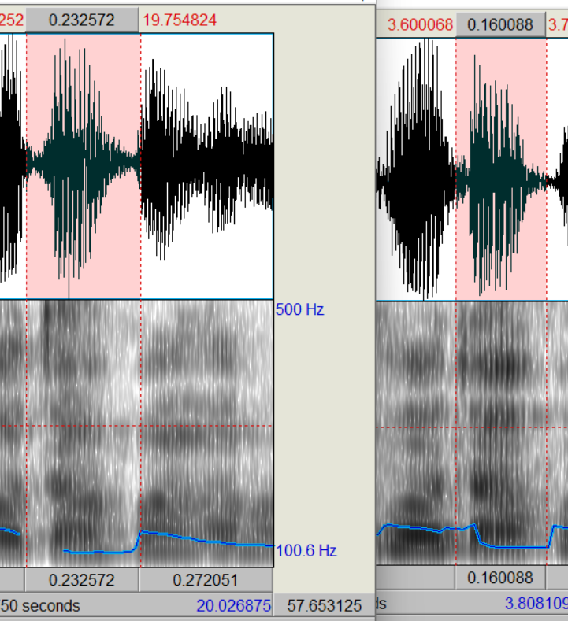
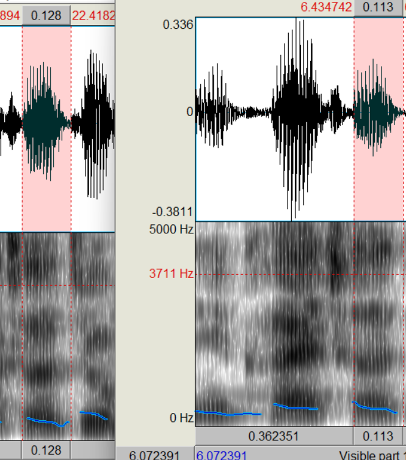
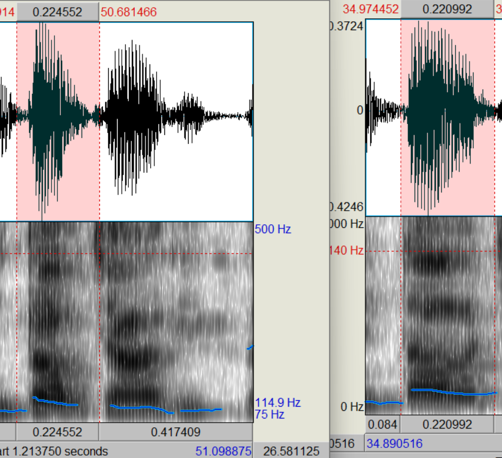
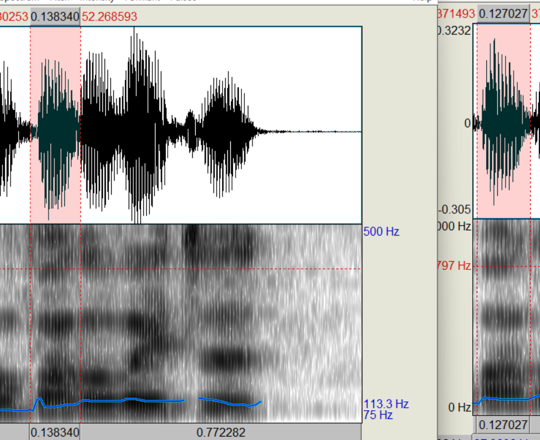
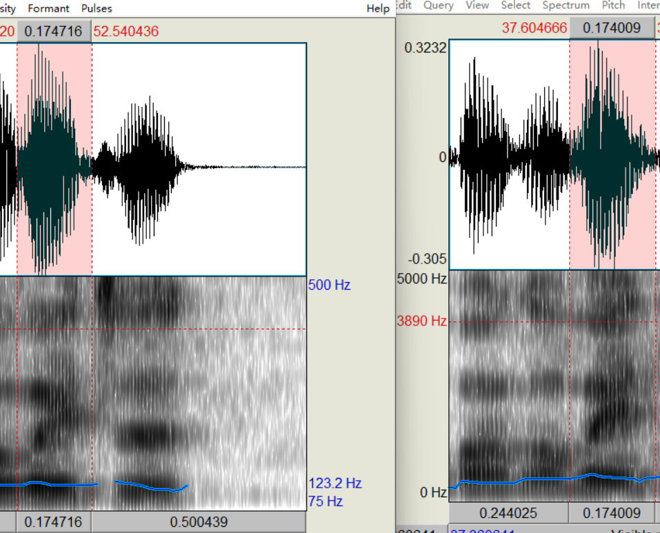
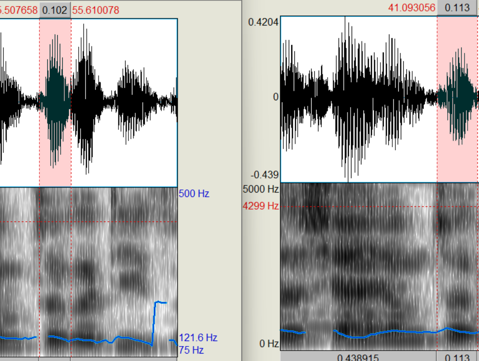
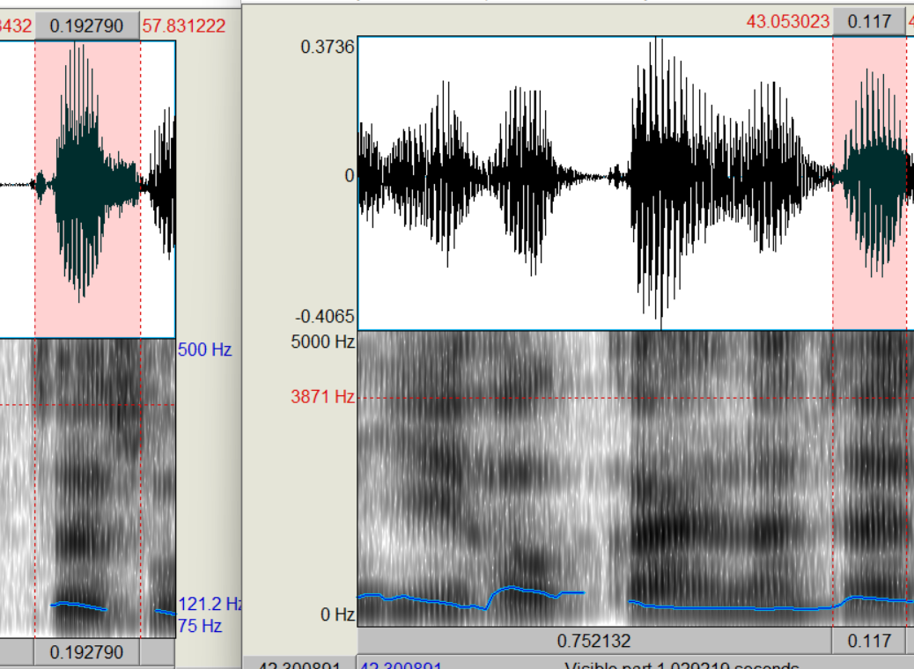
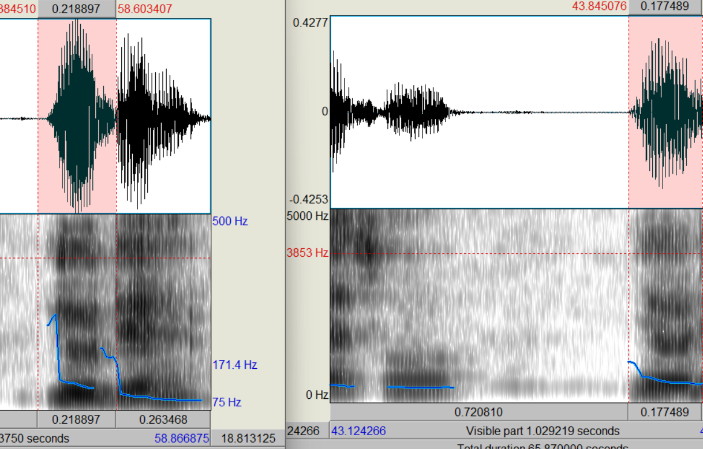

# 鉴定意见书

## 一、绪论

**1、委托单位：**××××××××××××

**2、送检人：**××× ×××

**3、受理日期：**2022年12月20日 

**4、检材：**存储在××××中的语音文件，文件名：检材.wav，文件大小：2.22MB，文件格式：wav 哈希值：706F58E14BA1A296630AB11202E08E3584E07CE9716D4B6BC0DEB04D83D2DE19（以下简称检材）。

**5、样本：**存储在××××中的语音文件，文件名：样本.wav，文件大小：2.39MB，文件格式：wav 哈希值： EB698A08837784B27447781A648FF61FBA1D9A02765540F0E9FABED1DFEF2F9E（以下简称样本）。

**6、鉴定要求：**鉴定检材样本是否为同一人。

**7、检验时间：**2022年12月20日至2022年12月22日

**8、检验地点：**南方科技大学

## 二、检验过程

**标准：**×××× 《××××技术规范》。

**设备：**Praat语音分析软件系统。

**（一）初步检验**

​    **1、对检材的检验**

​    将检材在上述语音分析软件系统打开（采样率16KHz，单声道“wav”格式， 位深16）。

​    经审听，检材语音自然、流畅，音量、语速适中，听觉特征反映充分;经图谱观察，频谱特征反映充分，未发现伪装变化迹象，具备检验条件。

​    **2、对样本的检验**

​     将样本上述语音分析软件系统中打开（采样率16KHz，单声道“wav”格式， 位深16）**。** 

​     经审听，样本语音自然、流畅，音量、语速适中，听觉特征反映充分，未发现伪装变化迹象;经图谱观察，频谱特征反映充分，具备检验条件

**（二）比对检验**

​     **1、听觉比对检验**

​     经对检材语音与样本语音进行比对审听，发现以下主要符合点：

 	1. 样本嗓音中等纯度，混杂南方口音。检材嗓音中等纯度，混杂南方口音。
 	2. 在对汉字`一会`的发音中，样本24.2s-24.4s发音为`yi hui`，检材8.21s-8.39s中发音为`yi hui`。
 	3. 在对汉字`队长`的长字发音中，样本24.9s-25.09s发音为`jiang`，检材9.5s-9.7s中发音为`jiang`。
 	4. 在对汉字`是`的发言中，样本43.16-43.6s中发言为`si`偏向'zi', 检材27.5-27.7s中发言为'si'偏向'zi'

​     **2、声谱比对检验** 

​    使用上述语音分析软件系统对检材语音和样本语音的宽带声谱的形态特征进行比对分析；发现以下符合点：

  1. 汉字`找`  （图谱见附录一）

     |            | 检材     | 样本     |
     | ---------- | -------- | -------- |
     | 第一共振峰 | 平       | 平       |
     | 第二共振峰 | 由高到低 | 由高到低 |
     | 第三共振峰 | 平       | 平       |
     | 第四共振峰 | 平       | 平       |
     
  2.  汉字`车` （图谱见附录二）

     |            | 检材 | 样本 |
     | ---------- | ---- | ---- |
     | 第一共振峰 | 平   | 平   |
     | 第二共振峰 | 平   | 平   |
     | 第三共振峰 | 平   | 平   |
     | 第四共振峰 | 平   | 平   |
     
  3.  汉字`到`  （图谱见附录三）

     |            | 检材     | 样本         |
     | ---------- | -------- | ------------ |
     | 第一共振峰 | 平       | 平           |
     | 第二共振   | 由高到低 | 由高到低再高 |
     | 第三共振峰 | 平       | 平           |
     | 第四共振峰 | 平       | 平           |
     
  4.  汉字`发`  （图谱见附录四）

     |            | 检材     | 样本     |
     | ---------- | -------- | -------- |
     | 第一共振峰 | 平       | 平       |
     | 第二共振峰 | 平       | 平       |
     | 第三共振峰 | 平       | 平       |
     | 第四共振峰 | 先平后高 | 先平后高 |
     
  5.  汉字`位` （图谱见附录五）

     |            | 检材     | 样本     |
     | ---------- | -------- | -------- |
     | 第一共振峰 | 平       | 平       |
     | 第二共振峰 | 由低到高 | 由低到高 |
     | 第三共振峰 | 先平后低 | 先平后低 |
     | 第四共振峰 | 由低到高 | 由低到高 |
     
  6.  汉字`这`  （图谱见附录六）

     |            | 检材     | 样本     |
     | ---------- | -------- | -------- |
     | 第一共振峰 | 平       | 平       |
     | 第二共振峰 | 平       | 平       |
     | 第三共振峰 | 由高到低 | 由高到低 |
     | 第四共振峰 | 平       | 平       |
     
  7.  汉字`再`  （图谱见附录七）

     |            | 检材 | 样本 |
     | ---------- | ---- | ---- |
     | 第一共振峰 | 平   | 平   |
     | 第二共振峰 | 平   | 平   |
     | 第三共振峰 | 平   | 平   |
     | 第四共振峰 | 平   | 平   |
     
  8.  汉字`六`  （图谱见附录八）

     |            | 检材             | 样本         |
     | ---------- | ---------------- | ------------ |
     | 第一共振峰 | 平               | 平           |
     | 第二共振峰 | 由高到低再平     | 由高到低再平 |
     | 第三共振峰 | 微微由高到低再平 | 平           |
     | 第四共振峰 | 平               | 平           |

​    **3、测量比对检验**

​     使用上述语音分析软件系统对检材语音和样本语音的宽带声谱的数值特征进行比对分析；发现以下差异点：

1.  汉字`找`  （图谱见附录一）

   |            | 检材    | 样本    |
   | ---------- | ------- | ------- |
   | 第一共振峰 | 466.9Hz | 458.7Hz |
   | 第二共振峰 | 1492Hz  | 1434Hz  |
   | 第三共振峰 | 2640Hz  | 2685Hz  |
   | 第四共振峰 | 3735Hz  | 3711Hz  |
   
2.  汉字`车`（图谱见附录二）

   |            | 检材    | 样本    |
   | ---------- | ------- | ------- |
   | 第一共振峰 | 522.8Hz | 513.9Hz |
   | 第二共振峰 | 1585Hz  | 1618Hz  |
   | 第三共振峰 | 2667Hz  | 2668Hz  |
   | 第四共振峰 | 4214Hz  | 4140Hz  |
   
3.  汉字`到`  （图谱见附录三）

   |            | 检材    | 样本    |
   | ---------- | ------- | ------- |
   | 第一共振峰 | 540.6Hz | 560.9Hz |
   | 第二共振峰 | 1416Hz  | 1508Hz  |
   | 第三共振峰 | 2662Hz  | 2576Hz  |
   | 第四共振峰 | 3797Hz  | 3883Hz  |
   
4.   汉字`发`  （图谱见附录四）

   |            | 检材    | 样本    |
   | ---------- | ------- | ------- |
   | 第一共振峰 | 447.1Hz | 421.9Hz |
   | 第二共振峰 | 1098Hz  | 1158Hz  |
   | 第三共振峰 | 2513Hz  | 2484Hz  |
   | 第四共振峰 | 3890Hz  | 3883Hz  |
   
5.  汉字`位`  （图谱见附录五）

   |            | 检材    | 样本    |
   | ---------- | ------- | ------- |
   | 第一共振峰 | 484.3Hz | 440.3Hz |
   | 第二共振峰 | 1638Hz  | 1710Hz  |
   | 第三共振峰 | 2475Hz  | 2447Hz  |
   | 第四共振峰 | 4020Hz  | 3993Hz  |
   
6.  汉字`这`  （图谱见附录六）

   |            | 检材    | 样本    |
   | ---------- | ------- | ------- |
   | 第一共振峰 | 502.9Hz | 495.5Hz |
   | 第二共振峰 | 1508Hz  | 1526Hz  |
   | 第三共振峰 | 2736Hz  | 2631Hz  |
   | 第四共振峰 | 3871Hz  | 3901Hz  |
   
7.  汉字`再`  （图谱见附录七）

   |            | 检材    | 样本    |
   | ---------- | ------- | ------- |
   | 第一共振峰 | 558.7Hz | 513.9Hz |
   | 第二共振峰 | 1657Hz  | 1600Hz  |
   | 第三共振峰 | 2736Hz  | 2649Hz  |
   | 第四共振峰 | 3883Hz  | 3853Hz  |
   
8.  汉字`六`  （图谱见附录八）

   |            | 检材    | 样本    |
   | ---------- | ------- | ------- |
   | 第一共振峰 | 465.7Hz | 421.9Hz |
   | 第二共振峰 | 1508Hz  | 1471Hz  |
   | 第三共振峰 | 2550Hz  | 2465Hz  |
   | 第四共振峰 | 3964Hz  | 4012Hz  |

## 三、分析论证

在听觉对比和图谱对比中，样本与检材特征相似，认为样本与检材为同一人的语言

## 鉴定意见

检材语音与样本语音是同一人的语音。

## 附录

​	*图中左侧为样本，右侧为检材*

### 附录一，汉字找

### 附录二 汉字车

### 附录三 汉字到

### 附录四 汉字发

    

### 附录五 汉字位

### 附录六 汉字这

### 附录七 汉字再

### 附录八 汉字六

